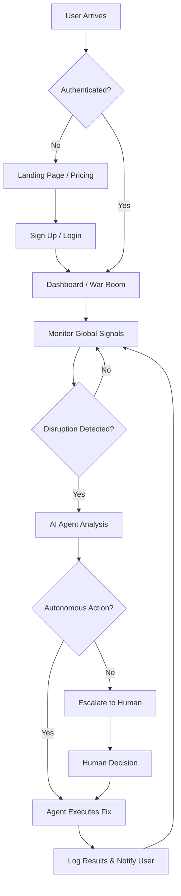

# NexusGuard

One-liner: An agentic AI platform that detects global supply chain threats in real time, simulates rerouting scenarios via a live digital twin, and autonomously executes the optimal response before disruption reaches the warehouse.

This is not a dashboard. This is not a risk score. This is a system that acts.

## Live Demo

https://supply-chain-logistics.vercel.app/

## Executive Summary

NexusGuard is positioned at the intersection of:
- a fast-growing supply chain risk market (`$2.47B` in 2024 to `$8.06B` by 2033, `13.8% CAGR`),
- a rapidly expanding agentic AI market (`$7.06B` in 2025 to `$93.2B` by 2032, `44.6% CAGR`),
- and a critical unmet need: autonomous execution for mid-market operators.

## Why This Matters Now

### Scale of disruption
- `70%` of companies experienced major supply chain disruptions in the last 5 years.
- Global annual losses from supply chain failures exceed `$1.6T`.
- `78%` of leaders expect disruptions to intensify in 2 years, while only `25%` feel prepared.
- Factory fires remained the `#1` disruption type for the 6th consecutive year (2025).
- US Customs denied `83%` of shipments YTD in 2025, representing `$55M+` in value.

### Infrastructure gap
Global infrastructure supporting supply chains faces a `$106T` investment gap through 2040. Combined with climate volatility and aging systems, disruption frequency and severity are structurally increasing.

### Execution gap
The core issue is not lack of AI, but lack of action:
- only `20%` of companies report meaningful AI value in supply chain,
- only `7%` report value from agentic/GenAI specifically,
- and most initiatives stall due to fragmented data, siloed systems, and undocumented workflows.

## Competitive Landscape

### Existing players
- Resilinc: advisory-led early warning, limited autonomous action.
- FourKites: visibility platform, not resilience execution.
- o9 / Llamasoft / Kinaxis: enterprise planning depth, limited real-time action loop.
- Everstream: risk intelligence without native execution.

### Capability matrix

| Capability | Typical incumbent pattern | NexusGuard |
|---|---|---|
| Real-time signal ingestion | Partial | ✅ |
| Multi-tier supplier mapping | Partial | ✅ |
| Digital twin simulation | Partial | ✅ |
| Real-time scenario simulation | Rare | ✅ |
| Autonomous execution | ❌ | ✅ |
| Cascade failure detection | Rare | ✅ |
| Mid-market accessibility | Limited | ✅ |
| Human-in-the-loop kill switch | Partial | ✅ |
| Confidence-threshold routing | Rare | ✅ |

## The 7 Moats

1. **Execution layer (core moat):** move from recommendation to direct operational action.
2. **Cascade failure detection:** second-order modeling across supplier dependencies.
3. **Confidence-threshold HITL:** auto-act above threshold, route below threshold to humans.
4. **SME/mid-market accessibility:** fast onboarding, lower implementation burden.
5. **Vertical specificity:** pharma cold chain as beachhead segment.
6. **Audit-native architecture:** full decision trace for compliance and governance.
7. **Outcome flywheel:** every execution creates labeled data that improves future decisions.

## Technical Architecture

### Layer 1: Signal ingestion
- News and geopolitical feeds
- Weather and climate feeds
- Port congestion/maritime data
- Optional social sentiment signals
- Internal ERP/TMS data (mocked in hackathon scope)

### Layer 2: Risk agent cluster
- Disruption classifier
- Severity scorer
- Supplier graph mapper
- Cascade simulator

### Layer 3: Decision engine
- Live digital twin
- Scenario generator (3-10 alternatives)
- Tradeoff scoring (cost, ETA, risk, compliance)
- Confidence evaluator (auto-execute vs approval path)

### Layer 4: Execution and audit
- Action executor (carrier/supplier/system updates)
- Audit logger (signals, options, score, approver, outcome)
- Outcome tracker (predicted vs actual)
- Real-time alert dashboard

## 48-Hour Hackathon Scope

- Integrate a small live signal stack (News + weather + mock port feed)
- Build one LLM-driven classify/severity agent
- Model one hardcoded pharma supply network (3 tiers)
- Generate 3 rerouting options with dynamic tradeoff scoring
- Set `85%` confidence threshold:
  - above threshold -> auto-execute,
  - below threshold -> approval modal
- Render audit trail from JSON logs in dashboard
- Demonstrate kill switch and human override path

## Business Model

### Revenue streams
- Platform subscription (SaaS)
- Per-action execution fee
- Vertical add-on modules (pharma, food, semiconductors)
- Enterprise tier (later phase)

### Target economics
- CAC: `$5K-$15K`
- LTV: `$80K-$300K`
- LTV:CAC target: `10:1+`
- Payback: `8-14 months`

### Market framing
- TAM: Supply chain management software (`$26B` in 2024 to `$45B` by 2030)
- SAM: supply chain risk/resilience AI segment (`~$8B` by 2033)
- SOM (Year 3 target): 500 mid-market customers x `$40K ARR` = `$20M ARR`

## 2-Minute Demo Flow

1. **Setup:** pharma distributor with India manufacturing, Suez logistics lane, Europe distribution.
2. **Disruption:** Suez conflict signal detected and auto-classified with high severity.
3. **Simulation:** digital twin evaluates three rerouting/sourcing options.
4. **Execution:** if confidence > threshold, agent executes and updates ETA/state.
5. **Kill switch:** low-confidence scenario pauses for human approval with ranked options.

## Risk Register (Demo)

| Risk | Likelihood | Impact | Mitigation |
|---|---|---|---|
| Live API failure | High | Critical | Pre-cache API responses as fallback JSON |
| LLM latency | Medium | High | Pre-compute key classification output |
| Scope creep | High | Critical | Freeze scope after core milestone |
| "Just a dashboard" objection | Medium | High | Lead with execution state change demo |
| Competitor parity objection | Medium | Medium | Emphasize execution + mid-market gap |

## Judge Q&A (Prepared Positioning)

- **How are you different from incumbent "agentic" launches?**  
  We close the loop with autonomous execution, not just recommendations.

- **How do you avoid costly AI mistakes?**  
  Confidence thresholds, scoped autonomy, and full audit/review trails.

- **How do you handle cold start?**  
  Start with public baseline priors, then shift to customer-specific rolling baseline within ~90 days.

- **Do you need deep ERP integration to start?**  
  Detection/simulation can start from supplier and shipment data; integration unlocks full autonomy.

- **What is GTM?**  
  Start with mid-market pharma cold chain via broker/association channels, then expand by vertical.

## Team Roles (4-Person Build)

- Agent Engineer: classification, scoring, cascade logic
- Full-Stack Developer: dashboard, map, approval UX, real-time updates
- Data/Backend Engineer: APIs, mock data, audit logger, scenario generation
- Product/Pitch Lead: narrative, demo script, judge prep, UX polish

## Getting Started

### Prerequisites
- Node.js 18+
- pnpm (recommended)

### Installation
```bash
git clone https://github.com/Subhadip-Paul2006/Supply_Chain_Logistics.git
cd Supply_Chain_Logistics
pnpm install
pnpm dev
```

Open [https://supply-chain-logistics.vercel.app](https://supply-chain-logistics.vercel.app)

## License

MIT
<<<<<<< HEAD
=======
# Agentic Supply Chain War Room

A unified detection layer and autonomous command center for global supply chain operations. This platform leverages Agentic AI to monitor, triage, and resolve high-priority logistics disruptions in real-time.

## 🚀 Overview

The **Agentic Supply Chain War Room** is designed to transform traditional supply chain management from reactive reporting to autonomous execution. By ingesting billions of global events, the platform provides a "single pane of glass" for logistics, trade compliance, and threat intelligence.

### Key Pillars
- **Autonomous Execution:** AI agents move beyond insights to execute actions across ERP, WMS, and TMS systems.
- **Global Visibility:** Real-time tracking across 190+ countries and major maritime routes.
- **Human-in-the-Loop:** Collaborative environment where humans govern autonomous agents.
- **Continuous Learning:** Systems that adapt strategies based on historical disruption outcomes.

## 🛠 Tech Stack

- **Framework:** [Next.js 15](https://nextjs.org/) (App Router)
- **Styling:** [Tailwind CSS 4](https://tailwindcss.com/)
- **UI Components:** [Radix UI](https://www.radix-ui.com/) & [Shadcn UI](https://ui.shadcn.com/)
- **Animations:** [Framer Motion](https://www.framer.com/motion/) & Embla Carousel
- **Icons:** [Lucide React](https://lucide.dev/)
- **Validation:** [Zod](https://zod.dev/) & React Hook Form

## 📂 Project Structure

```text
Supply_Chain_Logistics/
├── app/                  # Next.js App Router (pages & layouts)
│   ├── login/            # Authentication: Login
│   ├── signup/           # Authentication: Signup
│   ├── pricing/          # Subscription & Plans
│   ├── globals.css       # Global styles
│   ├── layout.tsx        # Root layout with ThemeProvider
│   └── page.tsx          # Landing page (GlobalTracker Hero)
├── components/           # React Components
│   ├── landing/          # Landing page specific components (ScrollGlobe, SiteHeader)
│   ├── ui/               # Reusable Shadcn UI components
│   └── theme-provider.tsx # Dark/Light mode provider
├── hooks/                # Custom React hooks
├── lib/                  # Utility functions and shared constants
│   ├── utils.ts          # Tailwind merge utility
│   └── auth-field-classes.ts # Shared auth styling
├── public/               # Static assets (images, icons)
├── styles/               # Additional style configurations
├── components.json       # Shadcn UI configuration
├── package.json          # Dependencies and scripts
└── tsconfig.json         # TypeScript configuration
```

## 🔄 User Flow

The following diagram illustrates how a user interacts with the platform and how the Agentic AI handles supply chain signals.



## 🚦 Getting Started

### Prerequisites
- Node.js 18+ 
- pnpm (recommended) or npm

### Installation

1. Clone the repository:
```bash
git clone https://github.com/Subhadip-Paul2006/Supply_Chain_Logistics.git
cd Supply_Chain_Logistics
```

2. Install dependencies:
 ```bash
pnpm install
```

3. Run the development server:
```bash
pnpm dev
```

## 📄 License

This project is licensed under the MIT License.
>>>>>>> 27daae86424907d87f94309a1a52935973540a41
