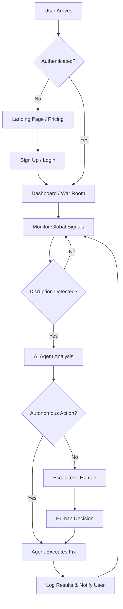

# Agentic Supply Chain War Room

A unified detection layer and autonomous command center for global supply chain operations. This platform leverages Agentic AI to monitor, triage, and resolve high-priority logistics disruptions in real-time.

## 🚀 Overview

The **Agentic Supply Chain War Room** is designed to transform traditional supply chain management from reactive reporting to autonomous execution. By ingesting billions of global events, the platform provides a "single pane of glass" for logistics, trade compliance, and threat intelligence.

### Key Pillars
- **Autonomous Execution:** AI agents move beyond insights to execute actions across ERP, WMS, and TMS systems.
- **Global Visibility:** Real-time tracking across 190+ countries and major maritime routes.
- **Human-in-the-Loop:** Collaborative environment where humans govern autonomous agents.
- **Continuous Learning:** Systems that adapt strategies based on historical disruption outcomes.

## 🛠 Tech Stack

- **Framework:** [Next.js 15](https://nextjs.org/) (App Router)
- **Styling:** [Tailwind CSS 4](https://tailwindcss.com/)
- **UI Components:** [Radix UI](https://www.radix-ui.com/) & [Shadcn UI](https://ui.shadcn.com/)
- **Animations:** [Framer Motion](https://www.framer.com/motion/) & Embla Carousel
- **Icons:** [Lucide React](https://lucide.dev/)
- **Validation:** [Zod](https://zod.dev/) & React Hook Form

## 📂 Project Structure

```text
Supply_Chain_Logistics/
├── app/                  # Next.js App Router (pages & layouts)
│   ├── login/            # Authentication: Login
│   ├── signup/           # Authentication: Signup
│   ├── pricing/          # Subscription & Plans
│   ├── globals.css       # Global styles
│   ├── layout.tsx        # Root layout with ThemeProvider
│   └── page.tsx          # Landing page (GlobalTracker Hero)
├── components/           # React Components
│   ├── landing/          # Landing page specific components (ScrollGlobe, SiteHeader)
│   ├── ui/               # Reusable Shadcn UI components
│   └── theme-provider.tsx # Dark/Light mode provider
├── hooks/                # Custom React hooks
├── lib/                  # Utility functions and shared constants
│   ├── utils.ts          # Tailwind merge utility
│   └── auth-field-classes.ts # Shared auth styling
├── public/               # Static assets (images, icons)
├── styles/               # Additional style configurations
├── components.json       # Shadcn UI configuration
├── package.json          # Dependencies and scripts
└── tsconfig.json         # TypeScript configuration
```

## 🔄 User Flow

The following diagram illustrates how a user interacts with the platform and how the Agentic AI handles supply chain signals.



## 🚦 Getting Started

### Prerequisites
- Node.js 18+ 
- pnpm (recommended) or npm

### Installation

1. Clone the repository:
```bash
git clone https://github.com/Subhadip-Paul2006/Supply_Chain_Logistics.git
cd Supply_Chain_Logistics
```

2. Install dependencies:
 ```bash
pnpm install
```

3. Run the development server:
```bash
pnpm dev
```

4. Open [(https://supply-chain-logistics.vercel.app)]
## 📄 License

This project is licensed under the MIT License.
